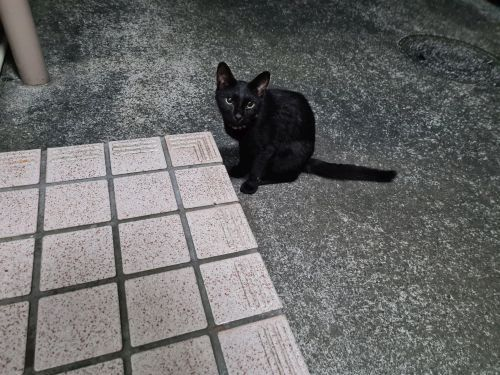
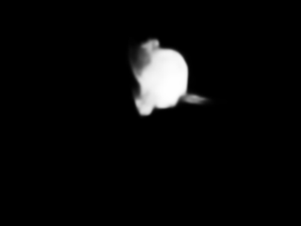

# tf-siammask
[SiamMask](https://github.com/foolwood/SiamMask) implementation with Tensorflow 2.0.

## Example
```python
import numpy as np
import PIL.Image
import siammask

sm = siammask.SiamMask()

# Weight files are automatically retrieved from GitHub Releases
sm.load_weights()

# Adjust this parameter for the better mask prediction
sm.box_offset_ratio = 1.5

img = np.array(PIL.Image.open('data/cat.jpg'))[..., ::-1]

# Predicted box and mask images is created if `debug=True`
box, mask = sm.predict(img, np.array([[214, 61], [315, 196]]), debug=True)
```

### `data/cat.jpg`


### Predicted mask for the image


## TODO
* [x] Bounding-box regression
* [x] Mask refinement network
* [x] Pre-trained model for Tensorflow 2.0
* [ ] Training code

## Reference
```
@inproceedings{wang2019fast,
    title={Fast online object tracking and segmentation: A unifying approach},
    author={Wang, Qiang and Zhang, Li and Bertinetto, Luca and Hu, Weiming and Torr, Philip HS},
    booktitle={Proceedings of the IEEE conference on computer vision and pattern recognition},
    year={2019}
}
```